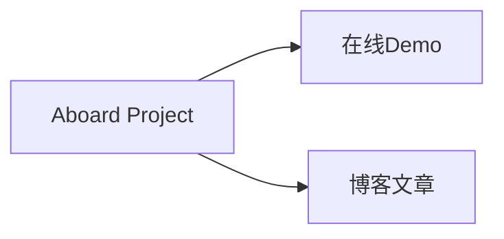
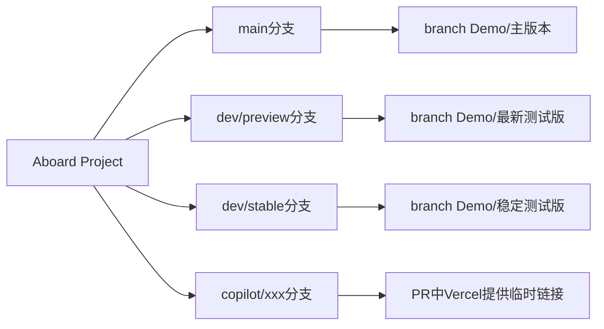

# Aboard

[简体中文](README.md) | [繁體中文](public/README.zh-TW.md) | [English](public/README.en.md)

<!-- version-badge:start -->

<!-- version-badge:end -->

一个面向课堂、演示与触控大屏场景的轻量网页白板。它尽量保持部署简单、上手直接、功能实用，适合“打开即用”和继续二次开发两种使用方式。

## 摘要
**大一小登的AI-Agent项目**，目标是想做一个**功能简单、部署简单，使用极其简单且符合直觉**的白板，主要是为**国内的初高中一体机教学使用设计**

由于本人的实际开发能力.....，所以本项目大量运用了**Agent Coding**，所以代码可能没有“人味”，也可能存在**相当多不合理的bug和开发方式**，**望大佬您轻喷**

您可以在下面的[**Demo链接**](https://aboard.pp.ua)中体验到本项目的全部，也可以前往[**我的博客**](https://619.pp.ua/article/aboard)看看我做这个项目的前因后果。

**如果大佬您觉得好的话，请给我点个star🌟吧~~~大学生真的很需要这个**

## 特色概览
- 常用白板能力齐全：画笔、形状、橡皮、背景、插图、插字、选择编辑。
- 课堂辅助功能完整：时间显示、计时器、随机点名、计分板、教具等。
- 体验偏向真实教学场景：分页画布、自动保存恢复、PWA、多语言、配置导入导出。
- 高倍率缩放时会自动切换到 SVG 矢量预览，让文字、图片、笔迹与形状在放大查看时更清晰。
- 默认缩放上限已提升到 `1000%`，需要更高倍率时仍可开启“允许无限放大”。
- 响应式与触控做了专门优化。

## 当前分支和部署版本

## 功能预览
<table cellpadding="10">
  <tr>
    <td width="50%" align="center" valign="top">
       
      <strong>功能：主界面</strong>
    </td>
    <td width="50%" align="center" valign="top">
       
      <strong>功能：时间与计时功能</strong>
    </td>
  </tr>
  <tr>
    <td width="50%" align="center" valign="top">
       
      <strong>功能：设置面板</strong>
    </td>
    <td width="50%" align="center" valign="top">
       
      <strong>功能：教具功能</strong>
    </td>
  </tr>
  <tr>
    <td width="50%" align="center" valign="top">
       
      <strong>功能：其他工具</strong>
    </td>
    <td width="50%" align="center" valign="top">
       
      <strong>功能：公告功能</strong>
    </td>
  </tr>
</table>

## 快速开始
- 在线体验：<https://aboard.pp.ua>
- 本地运行：`npm start` 或 `node server.js`
- 访问地址：<http://localhost:8080>
- 注意：不要直接双击 `index.html`，部分多语言、帮助与版本检查功能依赖 HTTP 环境。

## 文档导航
- 英文文档：[`public/README.en.md`](public/README.en.md)
- 繁体中文文档：[`public/README.zh-TW.md`](public/README.zh-TW.md)

## 响应式与触控说明
- 项目默认按触控优先设计，主要交互按钮尽量维持不少于 `44px` 的可触达面积。
- 在 1366×768、1920×1080、2K、4K 以及浏览器缩放后的窗口中，工具栏、历史栏、浮动面板、编辑叠加控件都会优先保证可见与可操作。
- 对于特别小的图片、文字框、选区或笔迹对象，控件会自动重排，必要时缩小但保留最小下限，尽量避免漂到对象外太远。
- 如果你继续二开，建议优先复用现有响应式变量、媒体查询和 `data-i18n-*` 机制，不要再写固定像素的绝对布局。

## 仓库结构
- `index.html`：主界面与静态结构。
- `js/main.js`：应用主控制器与事件编排。
- `js/modules/`：时间、计时器、教具、设置、存储、PWA、i18n 等模块。
- `css/style.css` 与 `css/modules/`：主样式与分模块样式。
- `server.js` / `sw.js`：本地服务、版本接口与离线缓存。

## 部署
### 部署到 Vercel

### 部署到 GitHub Pages
1. Fork 本仓库到你的 GitHub 账号。
2. 进入仓库设置 (Settings)。
3. 在 Pages 选项中，选择 Source 为 `main` 分支。
4. 点击 Save，等待部署完成。
5. 访问 `https://你的用户名.github.io/Aboard`。

### 部署到 Cloudflare Pages

## 🌟 致谢

感谢所有贡献者和使用者！如果这个项目对您有帮助，欢迎给个Star⭐，这样就对我很有帮助咯~~

## Star History

