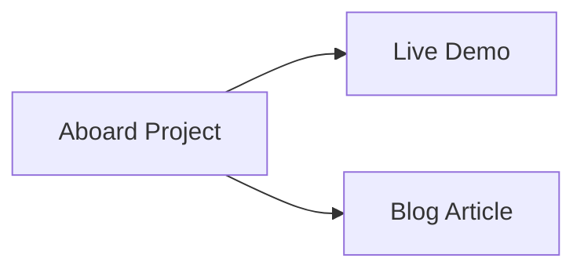
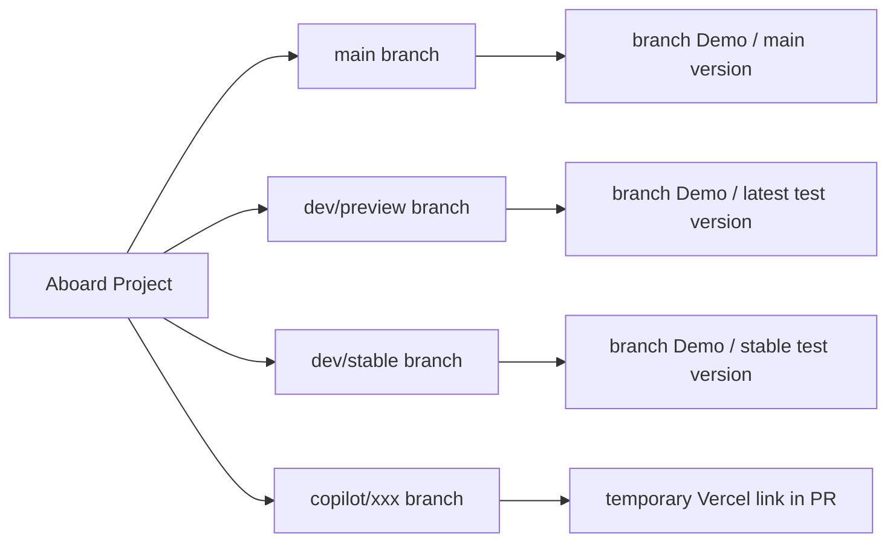

# Aboard

[Simplified Chinese](../README.md) | [Traditional Chinese](README.zh-TW.md) | [English](README.en.md)

<!-- version-badge:start -->

<!-- version-badge:end -->

A lightweight web whiteboard for classrooms, presentations, and touch-enabled large-screen scenarios. It tries to stay simple to deploy, easy to pick up, and practical to use, making it suitable both for "open and use right away" and for continued secondary development.

## Summary
**A freshman student's AI-Agent project**. The goal is to make a whiteboard that is **simple in features, simple to deploy, extremely simple and intuitive to use**, mainly **designed for teaching on integrated classroom displays in Chinese middle and high schools**.

Because my actual development ability is still limited, this project makes heavy use of **AI-Agent technology** (basically calling GitHub Agent features to help me develop and push features forward efficiently), so the code may not feel very "human", and there may also be **quite a lot of unreasonable bugs and development approaches**. **Please go easy on me, big shots**.

You can quickly try this project through the **Demo link** below, or visit **my blog** to see the full story of why I made it.

**If you think it's good, please give me a star 🌟~~~ College students really need this**

## Highlights
- Complete common whiteboard capabilities: pen, shapes, eraser, background, image insertion, text insertion, and selection editing.
- Complete classroom helper functions: time display, timer, random picker, scoreboard, teaching tools, and more.
- The experience is oriented toward real teaching scenarios: paginated canvas, automatic save and restore, PWA, multilingual support, and configuration import/export.
- At higher zoom levels, Aboard automatically switches to an SVG vector preview so text, images, strokes, and shapes stay sharper while magnified.
- The default zoom ceiling has been raised to `1000%`, and the unlimited zoom option can still extend beyond that.
- Responsive layout and touch interaction have been specially optimized.

## Current Branches and Deployed Versions

## Feature Preview
<table cellpadding="10">
  <tr>
    <td width="50%" align="center" valign="top">
       
      <strong>Feature: Main Interface</strong>
    </td>
    <td width="50%" align="center" valign="top">
       
      <strong>Feature: Time and Timer Features</strong>
    </td>
  </tr>
  <tr>
    <td width="50%" align="center" valign="top">
       
      <strong>Feature: Settings Panel</strong>
    </td>
    <td width="50%" align="center" valign="top">
       
      <strong>Feature: Teaching Tools</strong>
    </td>
  </tr>
  <tr>
    <td width="50%" align="center" valign="top">
       
      <strong>Feature: Other Tools</strong>
    </td>
    <td width="50%" align="center" valign="top">
       
      <strong>Feature: Announcement Feature</strong>
    </td>
  </tr>
</table>

## Quick Start
- Live demo: <https://aboard.pp.ua>
- Run locally: `npm start` or `node server.js`
- Access URL: <http://localhost:8080>
- Note: do not double-click `index.html` directly. Some multilingual, help, and version-check features depend on an HTTP environment.

## Documentation
- Architecture design: [`../docs/en/architecture.md`](../docs/en/architecture.md)
- Advanced notes: [`../docs/en/advanced.md`](../docs/en/advanced.md)
- English document: [`README.en.md`](README.en.md)
- Traditional Chinese document: [`README.zh-TW.md`](README.zh-TW.md)

## Responsive and Touch Notes
- The project is designed with touch first by default, and major interactive buttons try to maintain a tappable area of at least `44px`.
- In 1366×768, 1920×1080, 2K, 4K, and browser windows after zooming, toolbars, history panels, floating panels, and editing overlay controls all prioritize staying visible and operable.
- For especially small images, text boxes, selections, or stroke objects, controls automatically reflow and, when necessary, shrink while keeping a minimum lower bound, trying to avoid drifting too far outside the object.
- If you continue secondary development, it is recommended to reuse the existing responsive variables, media queries, and `data-i18n-*` mechanism first, and not write fixed-pixel absolute layouts again.

## Repository Structure
- `index.html`: main interface and static structure.
- `js/main.js`: application main controller and event orchestration.
- `js/modules/`: modules for time, timer, teaching tools, settings, storage, PWA, i18n, and more.
- `css/style.css` and `css/modules/`: main styles and module-based styles.
- `server.js` / `sw.js`: local service, version interface, and offline cache.

## Deployment
### Deploy to Vercel

### Deploy to GitHub Pages
1. Fork this repository to your GitHub account
2. Enter the repository settings (Settings)
3. In the Pages options, select `main` as the Source branch
4. Click Save and wait for deployment to finish
5. Visit `https://your-username.github.io/Aboard`

### Deploy to Cloudflare Pages

If this project helps you, feel free to give it a Star.
