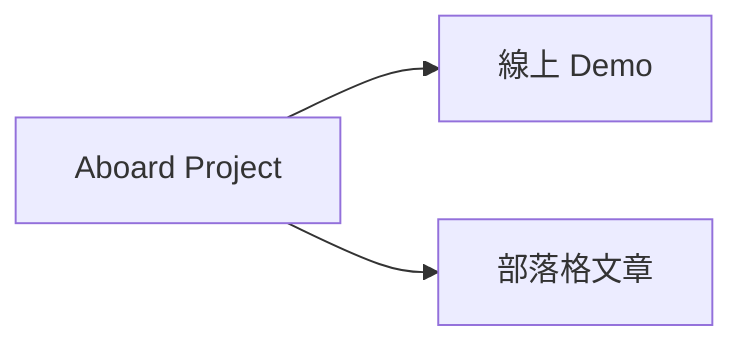
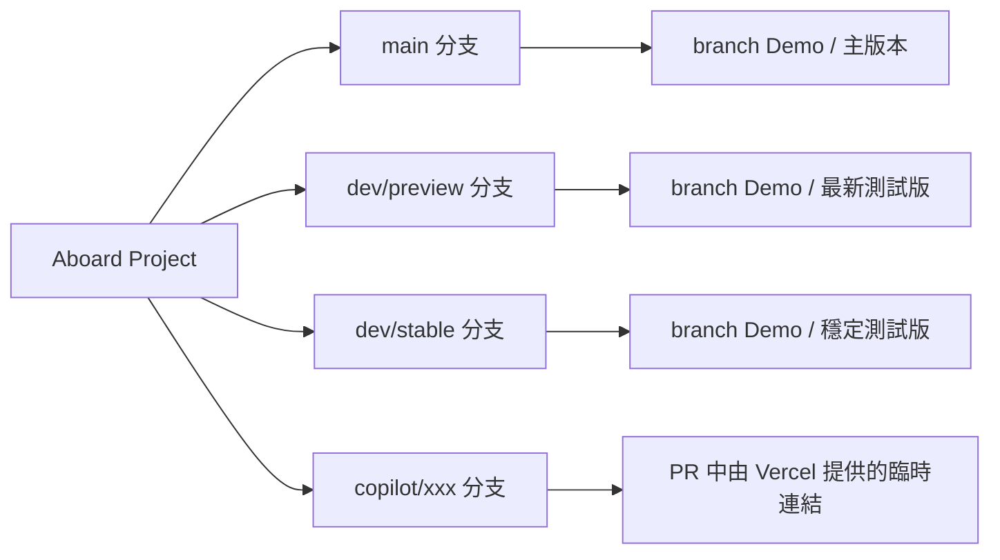
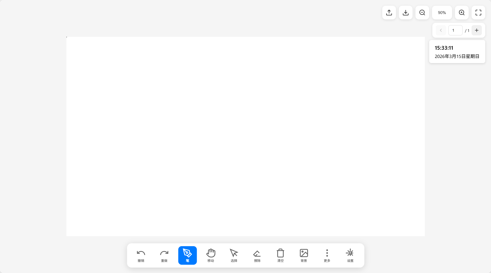
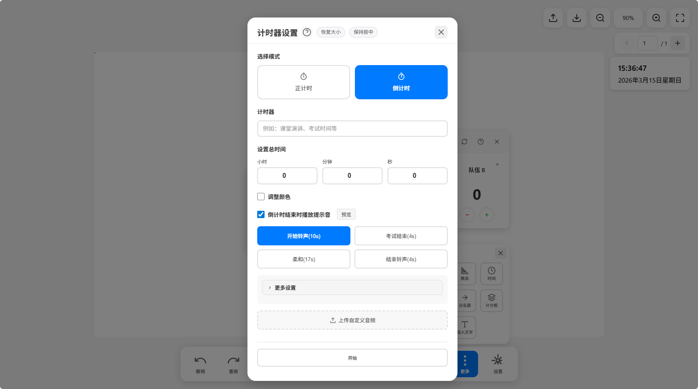
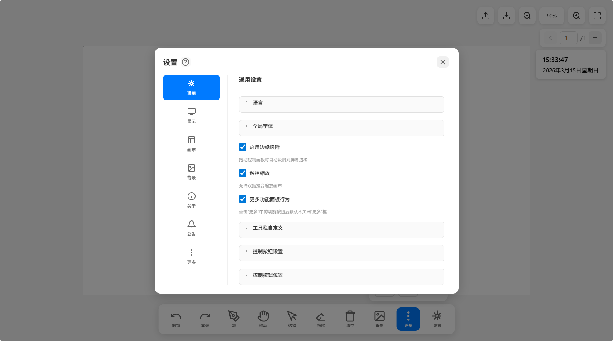
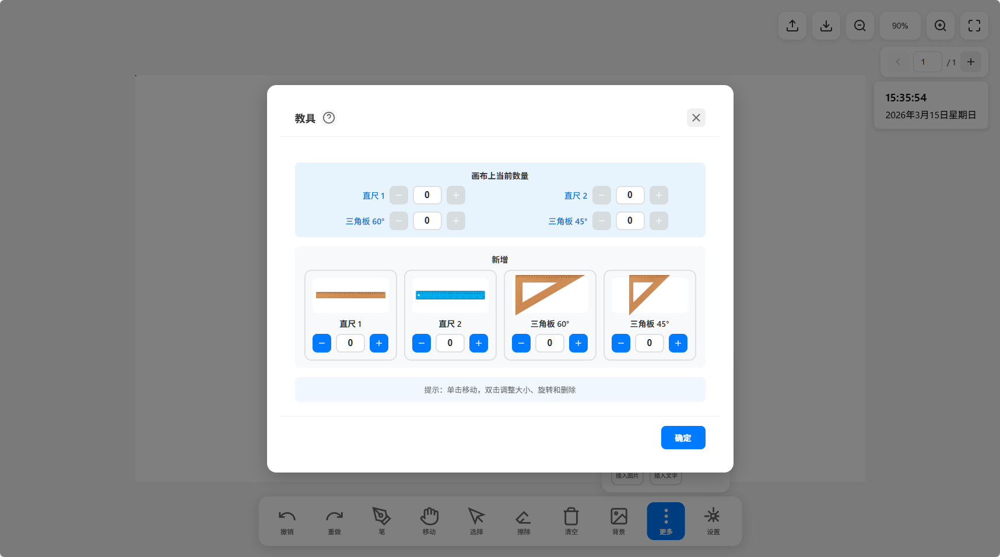
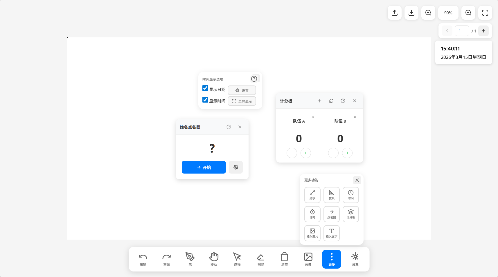
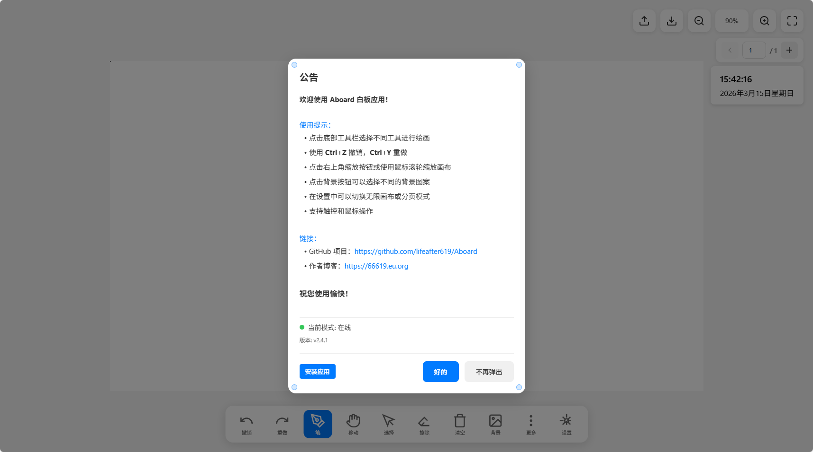

# Aboard

[簡體中文](../README.md) | [繁體中文](README.zh-TW.md) | [English](README.en.md)

<!-- version-badge:start -->

<!-- version-badge:end -->

一個面向課堂、展示與觸控大螢幕場景的輕量網頁白板。它盡量保持部署簡單、上手直接、功能實用，適合「打開即用」和持續二次開發兩種使用方式。

## 摘要
**大一小登的 AI-Agent 專案**，目標是想做一個**功能簡單、部署簡單，使用極其簡單且符合直覺**的白板，主要是為**中國國內初高中一體機教學使用設計**。

由於本人實際開發能力薄弱，所以本專案大量運用了 **AI-Agent 技術**（也就是呼叫 GitHub Agent 功能來幫助我開發並高效推進功能實作），所以程式碼可能沒有那麼「有人味」，也可能存在**相當多不合理的 bug 和開發方式**，**還望各位大佬手下留情**。

您可以在下面的 **Demo 連結**中快速體驗本專案，也可以前往**我的部落格**看看我做這個專案的前因後果。

**如果大佬您覺得好的話，請給我點個 star🌟吧~~~ 大學生真的很需要這個**

## 特色概覽
- 常用白板能力齊全：畫筆、形狀、橡皮擦、背景、插圖、插字、選擇編輯。
- 課堂輔助功能完整：時間顯示、計時器、隨機點名、計分板、教具等。
- 體驗偏向真實教學場景：分頁畫布、自動儲存恢復、PWA、多語言、設定匯入匯出。
- 高倍率縮放時會自動切換到 SVG 向量預覽，讓文字、圖片、筆跡與形狀在放大查看時更清晰。
- 預設縮放上限已提升到 `1000%`，若需要更高倍率仍可開啟「允許無限放大」。
- 針對響應式與觸控做了專門優化。

## 目前分支與部署版本

## 功能預覽
<table cellpadding="10">
  <tr>
    <td width="50%" align="center" valign="top">
       
      <strong>功能：主介面</strong>
    </td>
    <td width="50%" align="center" valign="top">
       
      <strong>功能：時間與計時功能</strong>
    </td>
  </tr>
  <tr>
    <td width="50%" align="center" valign="top">
       
      <strong>功能：設定面板</strong>
    </td>
    <td width="50%" align="center" valign="top">
       
      <strong>功能：教具功能</strong>
    </td>
  </tr>
  <tr>
    <td width="50%" align="center" valign="top">
       
      <strong>功能：其他工具</strong>
    </td>
    <td width="50%" align="center" valign="top">
       
      <strong>功能：公告功能</strong>
    </td>
  </tr>
</table>

## 快速開始
- 線上體驗：<https://aboard.pp.ua>
- 本地執行：`npm start` 或 `node server.js`
- 存取位址：<http://localhost:8080>
- 注意：不要直接雙擊 `index.html`，部分多語言、說明與版本檢查功能依賴 HTTP 環境。

## 文件導覽
- 英文文件：[`README.en.md`](README.en.md)
- 繁體中文文件：[`README.zh-TW.md`](README.zh-TW.md)

## 響應式與觸控說明
- 專案預設按觸控優先設計，主要互動按鈕盡量維持不少於 `44px` 的可觸達面積。
- 在 1366×768、1920×1080、2K、4K 以及瀏覽器縮放後的視窗中，工具列、歷史列、浮動面板、編輯疊加控制項都會優先保證可見與可操作。
- 對於特別小的圖片、文字框、選區或筆跡物件，控制項會自動重排，必要時縮小但保留最小下限，盡量避免漂到物件外太遠。
- 如果您繼續二次開發，建議優先複用既有的響應式變數、媒體查詢和 `data-i18n-*` 機制，不要再寫固定像素的絕對佈局。

## 倉庫結構
- `index.html`：主介面與靜態結構。
- `js/main.js`：應用主控制器與事件編排。
- `js/modules/`：時間、計時器、教具、設定、儲存、PWA、i18n 等模組。
- `css/style.css` 與 `css/modules/`：主樣式與分模組樣式。
- `server.js` / `sw.js`：本地服務、版本介面與離線快取。

## 部署
### 部署到 Vercel

### 部署到 GitHub Pages
1. Fork 本倉庫到您的 GitHub 帳號
2. 進入倉庫設定（Settings）
3. 在 Pages 選項中，選擇 Source 為 `main` 分支
4. 點擊 Save，等待部署完成
5. 存取 `https://你的使用者名稱.github.io/Aboard`

### 部署到 Cloudflare Pages

如果這個專案對您有幫助，歡迎點個 Star。
